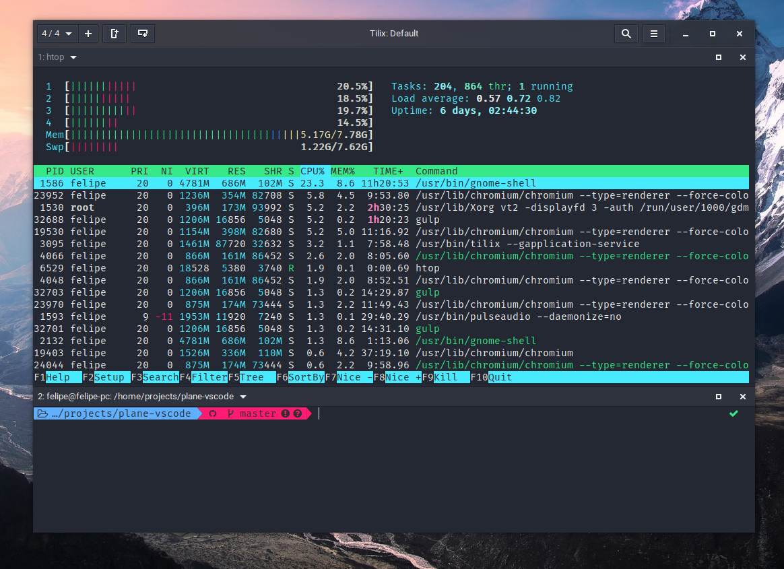

# PLANE-TILIX THEME

A beautiful theme for Tilix, more information in [Plane project](https://github.com/wfpaisa/plane).

 

## Install
1. Download `plane-dark.json` in `~/.config/tilix/schemes/plane-dark.json`.
2. Open: Tilix -> Preferences -> Profiles -> default -> Color -> Color scheme | choose: Plane dark.

## License

[MIT License](./LICENSE)
